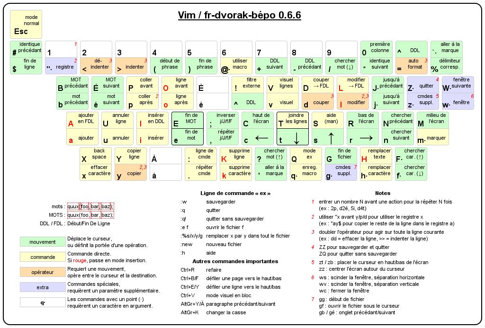

# Manual install

Copy the conf file to your home directory.

In order to use the vimrc you'll need to install vim-plug :
```
curl -fLo ~/.vim/autoload/plug.vim --create-dirs \
    https://raw.githubusercontent.com/junegunn/vim-plug/master/plug.vim
```

And then run `PlugInstall`

# Automatic install
```
sh install.sh
```

# Usage

Most of my layout was stolen from https://bepo.fr/wiki/Vim#Reconfiguration_partielle_des_touches

I’ve still updated this file to move the movement keys from `hjkl` to `jklm`.


